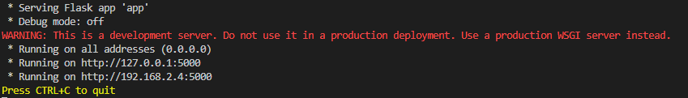
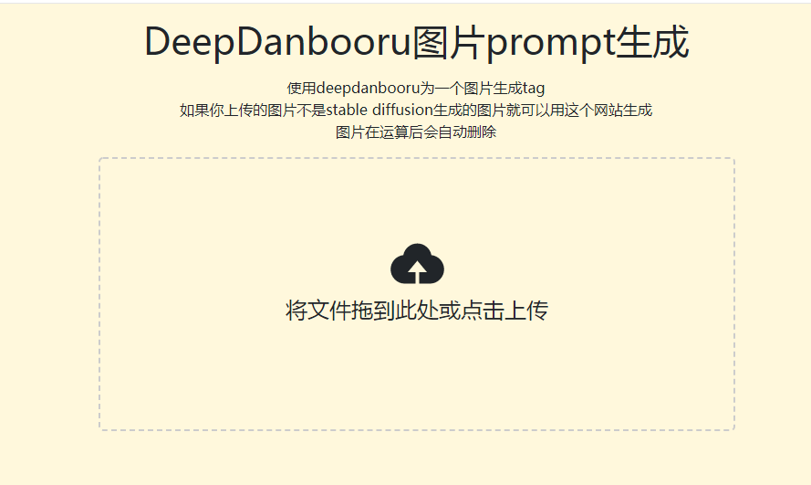
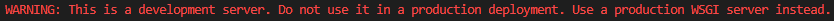

<p align="center">
  <h1 style="text-align: center;">DD-web-demo</h1>
</p>
作者：仙

email：tianhuzong@qq.com
QQ：[1485319167](http://wpa.qq.com/msgrd?v=3&uin=1485319167&site=qq&menu=yes)

## DD-webui:Deepdanbooru网页封装版

DD-webui是一个基于[Deepdanbooru](https://github.com/KichangKim/DeepDanbooru)（以下简称DD）封装的工具，采用Flask框架编写而成，根据DD的作者文档中的内容，需要python3.7+才能运行。由于DD的作者制作的在线工具服务器在国外，访问的速度较慢，所以DD-web-demo就此诞生了。
DD-webui有以下优势：
* **操作简易**：克隆仓库后可直接使用，无需过多设置，全程无坑
* **支持本地化部署**：不需要将图片上传到别人的服务器，本地直接加载预训练模型，节省上传到云端的时间，可以避免由于网络不稳定引起的错误
* **支持docker部署**：docker采用沙箱环境隔离机制，将容器与服务器隔离起来，较有效地避免服务器直接受到恶意代码攻击
* **占用空间低**：源代码只有几MB，预训练模型只有500MB，部署docker镜像也就需要4GB左右，不需要GPU也能快速反应

**在运行这个程序时提前加载了预训练模型，节省了生成tag的时间，本地部署响应速度会远远高于访问DD作者制作的demo**

## 许可证

本软件基于MIT开源协议进行授权和分发。

版权所有 (c) 2023 仙

本软件采用MIT许可证进行授权，允许被授权人有权使用、复制、修改、合并、发布、分发、再许可及/或销售本软件。

虽然本协议并未规定必须在衍生程序中标注原作者的名字，也没有规定衍生的程序必须开源，但还是鼓励大家标注原作者的名字，并且在非商用的情况下开源衍生程序

免责声明：本软件按"原样"提供，作者不承担任何明示或暗示的保证或责任。在任何情况下，作者对由使用本软件引起的任何损害或其他责任概不负责。

## 使用方法

### 环境安装
克隆本仓库：
```bash
git clone git@github.com:tianhuzong/DD-web-demo.git
```
或
```bash
git clone https://github.com/tianhuzong/DD-web-demo.git
```
国内可能由于github的DNS污染无法克隆，可以使用国内镜像仓库：
```bash
git clone git@gitee.com:thzsen/DD-web-demo.git
```
或
```bash
git clone https://gitee.com/thzsen/DD-web-demo.git
```

## 预训练模型下载
可以在[DD作者的发行版](https://github.com/KichangKim/DeepDanbooru/releases/tag/v3-20211112-sgd-e28)下载，然后把解压后的文件夹里的文件覆盖DD-web-demo/DD-webui/model内的文件。

## 运行程序
### 方法一：使用docker（推荐）：
克隆仓库，下载预训练模型后，打开docker终端，进入DD-web-demo目录，可以看到该目录下有个Dockerfile，不懂怎么修改请按照作者的原配置即可，懂的话可以适当自己修改
#### 构建镜像
**Tip：由于在Windows系统中，docker默认缓存目录是在C盘，我在github代码空间构建镜像时大约是3.5-4GB，缓存也是写在C盘的，如果C盘空间不够，你可以修改docker的配置文件**
运行命令：
```bash
docker build -t <镜像名称>. //例如docker build -t ddwebui .
```
最后面的``.``千万别忘记
由于镜像较大，构建过程需要点时间，趁着构建镜像的时间去刷个视频或吃点东西吧。

#### 运行镜像
只要你前面没有出错，那么恭喜你，你的镜像构建成功啦！
接下来你只需要运行镜像：
```bash
docker run -p 5000:5000 ddwebui 
```
运行完出现提示了就访问http://127.0.0.1:5000即可
**5000:5000第一个5000是在你的服务器或电脑上的端口，第二个5000是你在dockerfile中暴露的端口，如果你要修改docker暴露的端口记得要修改app.py的port哦！**

为了要节省生成tag的时间，我在源代码一开始运行的时候就加载了一遍预训练模型，大约要花7-8秒，不然的话每反推一次tag就得等8秒
**如果你使用的是github codespace，一般情况下有自动端口转发，然后就会给你弹出一个消息框让你在浏览器打开，但是请你先别急，在终端还没有弹出提示时，你直接打开会502**
你不想使用了可以直接按<kbd>Ctrl+C</kbd>退出，但是docker容器也会跟着关闭，如果你不想让终端一直挂着，但是想要继续运行容器，那就先<kbd>Ctrl+C</kbd>,然后运行``docker ps -a``找到你原来的那个容器的ID，运行``docker start <容器ID>``，反过来，如果你想要停止了就运行``docker stop <容器ID>``。

## 方法二：直接运行
直接运行适用于测试环境或开发环境，因为直接运行少了docker沙箱机制的保护，可能会受到恶意代码的攻击，请不要用这个办法部署生产环境。

克隆仓库，下载预训练模型后直接进入DD-web-demo/DD-webui

### 创建虚拟环境
```bash
python -m venv venv
```
### 进入虚拟环境
```bash
Windows:
cd venv
Scripts\activate.bat
如果你使用的是PowerShell
那就使用
Scripts\Activate.ps1
Linux/Mac OS:
source venv/bin/activate
```
### 安装依赖
```bash
pip install -r requirements.txt
pip install .
```
运行完可以删除deepdanbooru文件夹和setup.py的文件
### 运行主程序
```bash 
python app.py
```
或者设置环境变量``FLASK_APP=app.py``，然后运行
```bash
flask run
//有些电脑/服务器可能会报错，推荐使用
python -m flask run
```
当你看到以下图片


那就说明你已经成功啦!
然后访问http://127.0.0.1:5000
界面大概长这样：


因为本人画画并不是很好ui比较简陋，还请谅解。
### 部署uWSGI
你在直接运行flask程序时是不是看到了以下警告：


**本人英文不是很好，我认为要部署WSGI服务器就对了**

**经过测试，Windows貌似不可以使用uwsgi，可以选择使用其他wsgi服务器，不然就乖乖使用docker吧**

说干就干，我在requirements.txt中已经加入了uwsgi库的安装了，看不懂的可以参考[菜鸟教程-uwsgi](https://www.runoob.com/python3/python-uwsgi.html)
在docker中我已经部署了uwsgi了，我就不做演示
#### 方法一：
在菜鸟教程中，是直接运行一行命令的：
```bash
uwsgi --socket 127.0.0.1:Flask端口 --wsgi-file flask文件名 --callable 变量名 --processes 启动进程数 --threads 每个进程的线程数 --stats 127.0.0.1:uWSGI服务器的统计端口号
```
例如
```bash
uwsgi --socket 127.0.0.1:5000 --wsgi-file app.py --callable app --processes 4 --threads 2 --stats 127.0.0.1:9191
```
**我想那个变量名应该是``app=Flask(__name__)``的变量名**
参数尽量别去调，调参数参考网上的说明

## API调用
有时候一直要上网站访问，实在是太麻烦了，索性就搞了一个API，但是我没有写什么token还是QPS机制，所以还麻烦各位开发者多多费心了。
API地址：``你的域名/api/upload``
与网页上上传的不同的是，这个API支持get和post
|参数名称|参数说明|
|---|---|
|pic|图片数据，将文件的二进制数据转为base64编码|
|kuozhanming|文件扩展名，jpg或png，不要带``.``，带了``.``或者是其他格式会返回{"msg":"error"}|
|yz|生成的标签的评分的阈值，阈值越大得到的标签越少推荐使用0.5-0.75|


易语言的用户可以使用``读入文件()``将图片转为字节集数据，再使用精易模块把字节集数据转为base64编码，然后再使用精易模块的``网页_访问S（）``
python的用户可以使用base64模块
```python
import base64
import requests
url = "你的域名/api/upload"
with open("/path/to/image.png",mode="rb") as f:
    pic = f.read()
pic_b64 = base64.b64encode(pic).decode()
data = {
    pic:pic_b64,
    kuozhanming : "png"
}
res = requests.post(url,data=data)
#虽然说支持get，但使用post还是比较安全，不会受url长度限制
```
**其他语言的用户可以使用[CodeGeeX](https://github.com/THUDM/CodeGeeX)把代码翻译成其他语言**

## 部署web服务器
在你体验完这个网站后，想要把它暴露到公网以便自己在其他地方使用或者你做了修改想给其他用户使用，那么你可以选择部署web服务器，但前提是你得拥有一台服务器。

nginx是一个比较有名的web服务器，安装也比较简单，可以参考[菜鸟教程-nginx教程](https://www.runoob.com/w3cnote/nginx-install-and-config.html)，部署在云端环境，本人还是推荐使用docker，免得图片上传接口被攻击

我们的NGINX就不能使用docker部署了，因为我们前面的docker镜像只能有一个docker基础镜像，没办法使用yum或apt等包管理器，而不同的容器是沙箱隔离的，如果你有办法的话欢迎创建issue讨论。
### 安装环境
在Windows安装nginx，因为我的电脑配置不好，承受不了了，就在网上找了教程，大概是这样：

- 下载NGINX安装程序：打开[NGINX的官方网站](https://nginx.org/)，在主页上找到并点击 "Download"（下载）链接。在"Stable version"（稳定版本）下，选择适用于Windows的zip格式的安装文件下载。

- 解压安装文件：将下载的zip文件解压到一个目录.

- 配置NGINX：在解压后的目录中，打开 conf 文件夹，并编辑 nginx.conf 文件来配置NGINX。你可以根据需要进行自定义配置，包括监听端口、处理静态文件的路径等。

- 启动NGINX：打开命令提示符，导航到NGINX安装目录的 sbin 文件夹中，执行命令nginx 来启动NGINX服务。

- 验证安装：打开Web浏览器，输入 http://localhost/ 或者 http://127.0.0.1/ ，如果显示了NGINX的欢迎页面，则表示安装成功。

- 如果你希望关闭NGINX服务，可以在命令提示符中运行 nginx -s stop 或者 nginx -s quit 命令来停止NGINX。

使用Linux的朋友可以前往[菜鸟教程 | Linux-nginx安装](https://www.runoob.com/linux/nginx-install-setup.html)

### 配置nginx

在本地创建个文件夹，里面创建个文件，文件就命名为nginx.conf
里面的内容这么写：
```conf
http {
    server {
        listen 80;
        server_name example.com;

        location / {
            proxy_pass http://127.0.0.1:5000;
            proxy_set_header Host $host;
            proxy_set_header X-Real-IP $remote_addr;
        }
    }
}
```
example.com换成你的域名，记得要解析到服务器上哦
下面location的配置proxy_pass的端口如果你修改了flask的端口也记得去改

修改后去查一查怎么运行吧

## 小小吐槽

我不建议部署在github codespace，因为我在github codespace部署时一直得不到返回值，我看下是因为上传文件的问题，使用codespace部署可能会导致无法上传文件

## 结语
本程序基于Deepdanbooru开发而成

请不要用于非法用途

后果自负


本人新手上路，可能有什么错误没有，或者测试的还不完全
如果发现错误的朋友请在issue中提出，谢谢

© 仙 2023